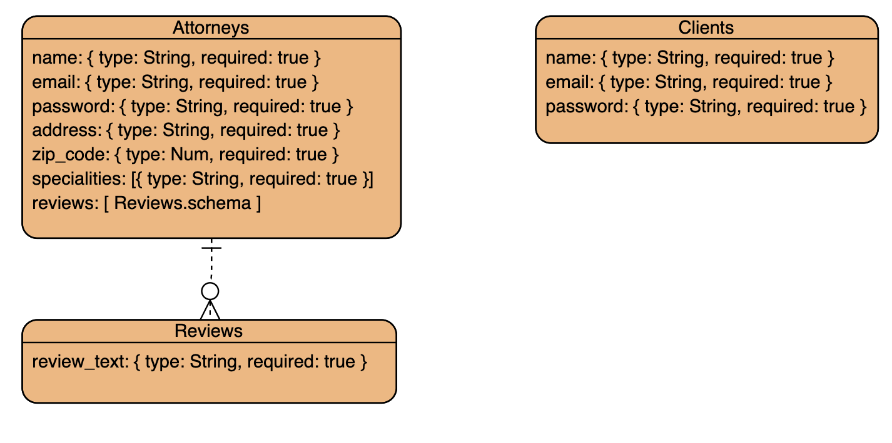
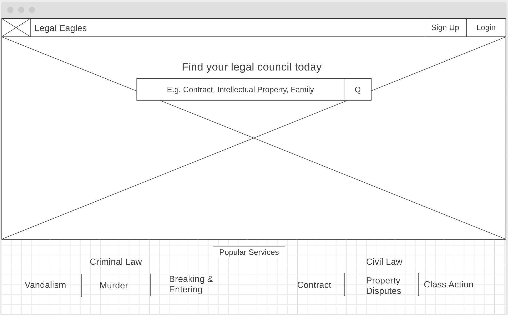
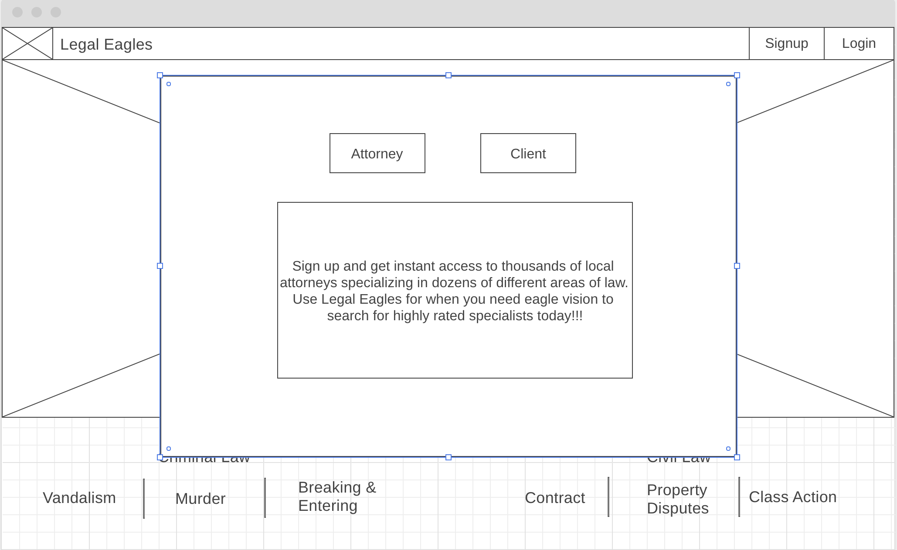
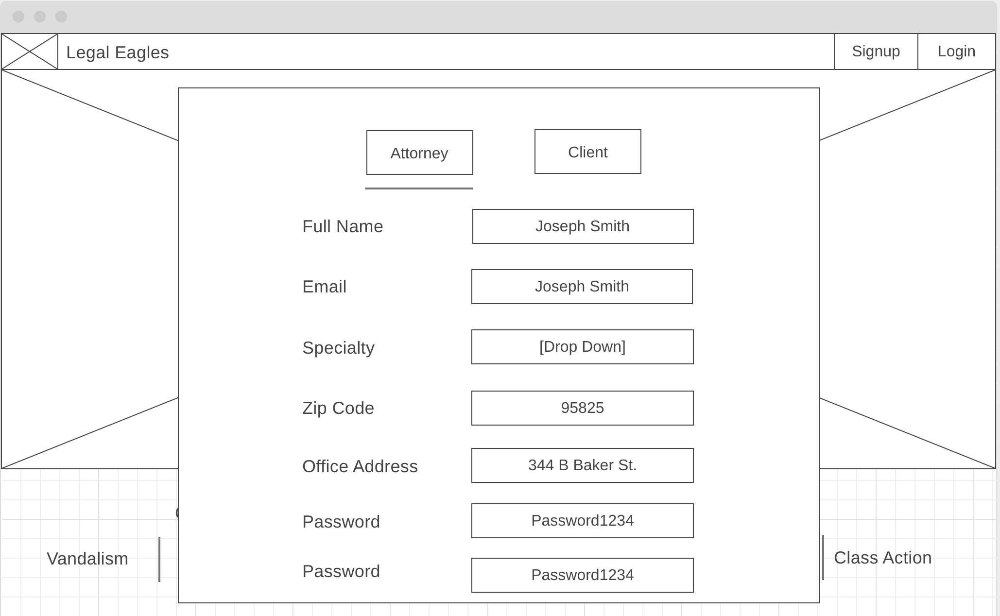
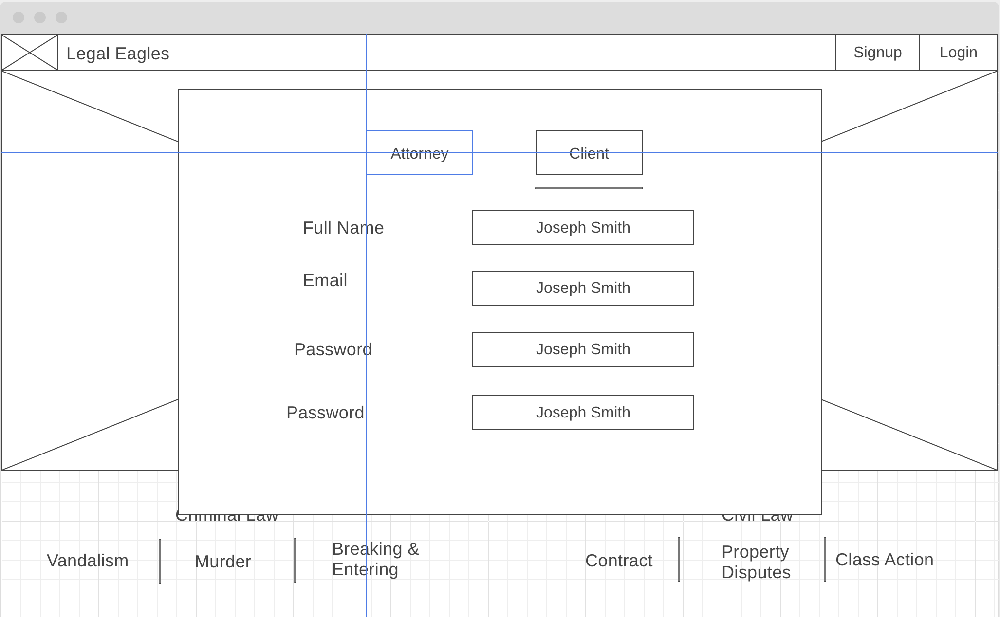
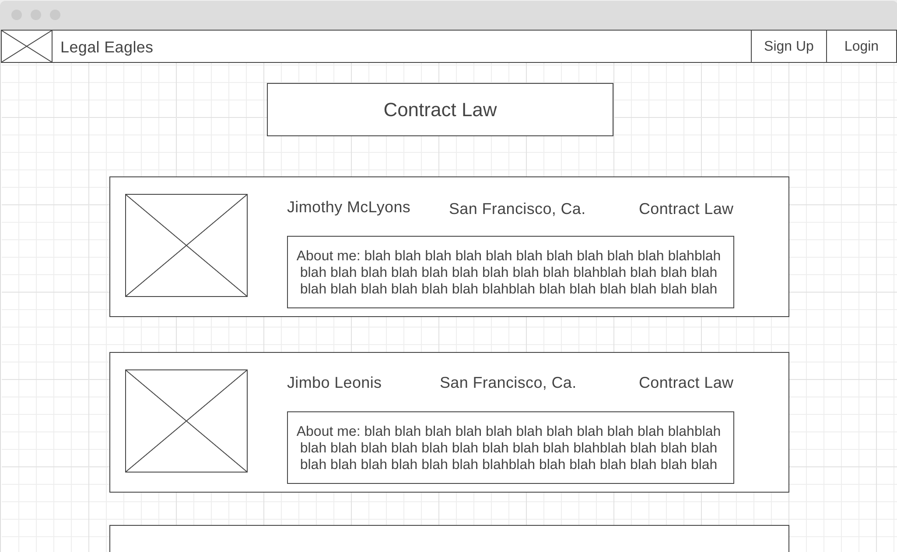
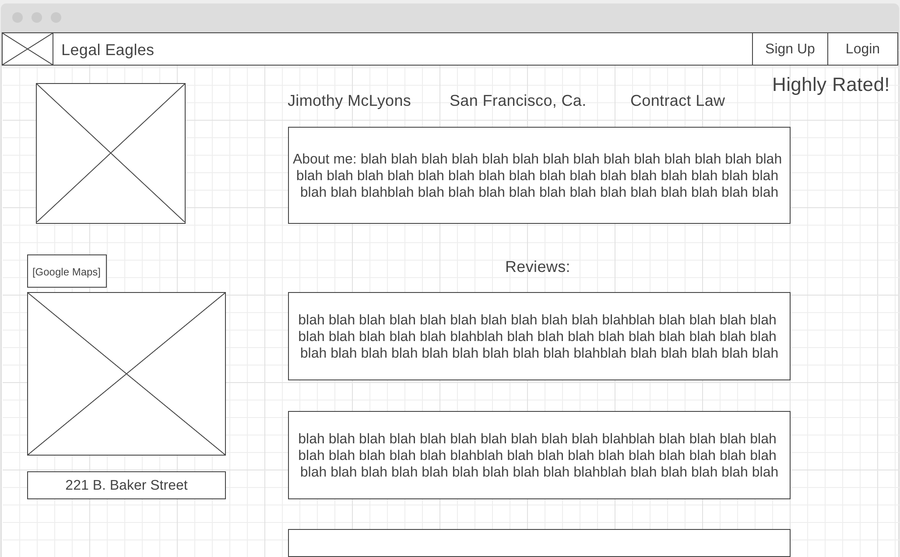

# Legal Eagles Server

## Links
- Front End repo: https://github.com/james-lyons/legal_eagles_react
- Heroku Link: https://legal-eagles-react.herokuapp.com/

## Technologies Used
- Full M.E.R.N. stack
- Database: MongoDB & Mongoose
- Server Enviornment: Node.js
- Server Framework: Express.js
- Front end Framework: React
- State management for React: Redux
- Style Libraries: React Bootstrap
- Version Control: Github / Git
- Deployment Method: Heroku

## Wireframes
- Many things changed as I started coding
- Decided not to use google maps because I didn't think it would be wise to have the address of a legal professional out there for anyone to easily find, just in case.

## Things to do
- Add MailChimp and Captcha API for authentication

## Take-awayss
- Making two different user types was interesting in terms of how to render React components
- Redux is nice but it's difficult to initially get conceptually